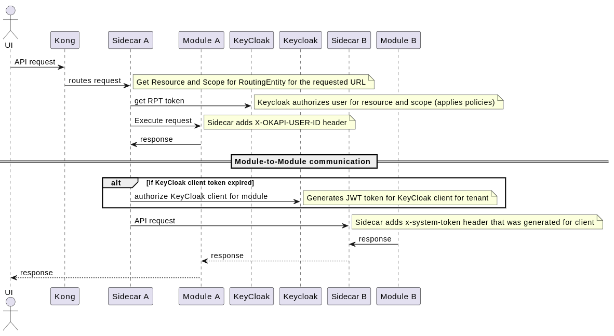

# folio-module-sidecar

Copyright (C) 2023-2025 The Open Library Foundation

This software is distributed under the terms of the Apache License,
Version 2.0. See the file "[LICENSE](LICENSE)" for more information.

## Table of contents

* [Introduction](#introduction)
* [Compiling](#compiling)
    * [Creating a native executable](#creating-a-native-executable)
* [Running It](#running-it)
* [Environment Variables](#environment-variables)

## Introduction

`folio-module-sidecar` provides following functionality:

* This project uses [Quarkus](https://quarkus.io/)
* module independent, uses Okapi Module Descriptors for self-configuration
* Ingress request routing for underlying module (specified using environment variables)
* Egress request routing for module-to-module communication

## Compiling

The application can be compiled using:

```shell script
mvn clean install
```

See that it says `BUILD SUCCESS` near the end.

If you want to skip tests:

```shell
mvn clean install -DskipTests
```

The application is packaged as an _uber-jar,_ and it is now runnable using `java -jar target/*-runner.jar`.

### Creating a native executable

You can create a native executable using(for default native build):

```shell script
mvn package -Pnative
```

If target and build nodes are having different CPU(but same manufacturer, such as AMD(zenv1,2), Intel etc.) and features, you may build portable native image using:

```shell script
mvn package -Pnative -Dnative.march=-march=compatibility
```

Or, if you don't have GraalVM installed, you can run the native executable build in a container using:

```shell script
mvn install -Pnative -DskipTests \
  -Dquarkus.native.container-build=true \
  -Dquarkus.native.builder-image=quay.io/quarkus/ubi-quarkus-mandrel-builder-image:jdk-21
```

You can then execute your native executable with: `./target/folio-module-sidecar-1.0.0-SNAPSHOT.jar`
If you want to learn more about building native executables, please consult https://quarkus.io/guides/maven-tooling.

## Running It

Quarkus sidecar application can be run in development mode.

You can run your application in dev mode that enables live coding using (example for `mod-users-18.2.0`
from `folio-platform-minimal`):

```shell script
mvn clean quarkus:dev \
  -Dquarkus.http.port=19002 \
  -DSIDECAR_URL="http://localhost:19002" \
  -DMODULE_ID="mod-users-18.2.0" \
  -DMODULE_NAME="mod-users" \
  -DMODULE_URL="http://localhost:9002" \
  -DAM_CLIENT_URL="http://mgr-applications:8081" \
  -DTE_CLIENT_URL="http://mgr-tenant-entitlements:8081" \
  -DTM_CLIENT_URL="http://mgr-tenants:8081" \
  -Dquarkus.live-reload.instrumentation=true \
  -Ddebug=11002
```

> **_NOTE:_**
>
> * $OKAPI_TOKEN is optional, it can be set using command: `export OKAPI_TOKEN="$token_value"`
> * Remote JVM debugger can be attached using port = `11002`.
> * Quarkus now ships with a Dev UI, which is available in dev mode only at http://localhost:19002/q/dev/.

### Building And Running JVM Based docker container

This Dockerfile is used in order to build a container that runs the Quarkus application in JVM mode
Before building the container image jar file must be compiled (see [Compiling](#compiling) section).
Then, build the image with:

```shell
docker build -t folio-module-sidecar .
```

Then run the container using:

```shell
docker run -i --rm -p 8081:8081 folio-module-sidecar
```

### Building and Running Native docker container

This [Dockerfile](docker/Dockerfile.native) is used in order to build a container that runs the Quarkus application in
native (no JVM) mode. Before building the container image run:

```shell
mvn install -Pnative -DskipTests \
  -Dquarkus.native.container-build=true \
  -Dquarkus.native.builder-image=quay.io/quarkus/ubi-quarkus-mandrel-builder-image:jdk-21
```

Then, build the image with:

```shell
docker build -f docker/Dockerfile.native-micro -t folio-module-sidecar-native .
```

Then run the container using:

```shell
docker run -i --rm -p 8080:8080 quarkus/sidecar
```
### Building FIPS compatible image

```shell
export QUARKUS_SECURITY_SECURITY_PROVIDERS=BCFIPSJSSE
mvn clean -Pfips install
docker build -f docker/Dockerfile.fips -t {{image-tag}}:{{image-version}}
```

### Difference between building native executables using a docker-approach and a Graalvm-approach

#### Using Docker

To build a native executable in a container using a Linux image
(e.g. quay.io/quarkus/ubi-quarkus-mandrel-builder-image:jdk-21 with size 1.29Gb) with the required build tools,
use the following command:

```
mvn package -Pnative -Dquarkus.native.container-build=true
```

When you use this command, Maven will build a container and run the native-image command inside that container.
This means you don't need to install GraalVM and the necessary build tools on your host machine.
It requires container runtime (Docker, podman) environment.
However, this method may be slower than building natively on your machine,
and it takes approximately 40-50 seconds longer than building it on GraalVM.
The resulting native executable's size is 63731kb, its Docker image size is 167.82 Mb,
and micro docker image size 94.65 Mb

#### Using GraalVM

To build a native executable of your Quarkus application using GraalVM, use the following command:

```
mvn install -DskipTests -Pnative
```

If you use this command, you must have GraalVM and the necessary build tools installed on your machine.
Including, Visual Studio C++ build tools, If you use windows. Then, _x64 Native Tools Command Prompt_ should
be opened to run previous command to build a native binary.
Otherwise, you may encounter errors during the build process.
The resulting native binaries size is 64964kb, its docker image's size is 102.56 MB,
and micro docker image size 95.91 MB,  this approach _has some drawbacks executing in a docker container._

In general, if you are developing on a machine that has _GraalVM and the necessary build tools installed,
it is faster to use GraalVM approach_.
However, if you don't have GraalVM and the necessary build tools installed,
or if you want to build the native executable in a more isolated environment,
to get consistent result on different environments
you should use container approach.
for more details please visit https://quarkus.io/guides/building-native-image

> **_NOTE:_** Native micro-image can be generated using [Dockerfile](docker/Dockerfile.native-micro)
>
> A native micro base image is tuned for Quarkus native executables. It reduces the size of the resulting container
> image. Check https://quarkus.io/guides/quarkus-runtime-base-image for further information about this image.

## Environment Variables

| Name                                         | Default value           | Required | Description                                                                                                                                                                                                                                                    |
|:---------------------------------------------|:------------------------|:--------:|:---------------------------------------------------------------------------------------------------------------------------------------------------------------------------------------------------------------------------------------------------------------|
| MODULE_NAME                                  |                         |  false   | Underlying module name. If `MODULE_ID` is not specified, required                                                                                                                                                                                              |
| MODULE_VERSION                               |                         |  false   | Underlying module version. If `MODULE_ID` is not specified, required                                                                                                                                                                                           |
| MODULE_URL                                   |                         |   true   | Underlying module URL.                                                                                                                                                                                                                                         |
| MODULE_HEALTH_PATH                           | /admin/health           |  false   | Underlying module health check path.                                                                                                                                                                                                                           |
| SIDECAR_URL                                  |                         |   true   | Self URL for module-to-module communication.                                                                                                                                                                                                                   |
| SIDECAR_MODULE_PATH_PREFIX_ENABLED           | false                   |  false   | Defines if module path prefix is enabled for routing or not. It enables the ability to route properly requests starting with `/$moduleName/...`                                                                                                                |
| SIDECAR_MODULE_PATH_PREFIX_STRATEGY          | NONE                    |  false   | Defines if module path prefix strategy, if `SIDECAR_MODULE_PATH_PREFIX_ENABLED=true` then `PROXY` is used                                                                                                                                                      |
| REQUEST_TIMEOUT                              | 60000                   |  false   | Configures the amount of time in milliseconds after which if the request does not return any data within the timeout period fails the request.                                                                                                                 |
| RETRY_ATTEMPTS                               | 10                      |  false   | Sets the maximum number of retries, must be >= -1 (-1 = unlimited).                                                                                                                                                                                            |
| RETRY_BACKOFF_FACTOR                         | 2                       |  false   | Sets the multiplicative factor used to determine delay between retries, must be >= 1.                                                                                                                                                                          |
| RETRY_MIN_DELAY                              | 5s                      |  false   | Sets the min delay between retries, must be >= 0.                                                                                                                                                                                                              |
| RETRY_MAX_DELAY                              | 2m                      |  false   | Sets the maximum delay between retries, must be >= 0.                                                                                                                                                                                                          |
| SIDECAR_FORWARD_UNKNOWN_REQUESTS             | false                   |  false   | Set behavior for EGRESS request. If there are no information about discovery, request will be forwarded to the `SIDECAR_FORWARD_UNKNOWN_REQUESTS_DESTINATION`. If `SIDECAR_FORWARD_UNKNOWN_REQUESTS` is enabled, `ROUTING_DYNAMIC_ENABLED` should be disabled. |
| SIDECAR_FORWARD_UNKNOWN_REQUESTS_DESTINATION | http://api-gateway:8000 |  false   | URL of gateway for routing unknown EGRESS requests. This URL will be used if `SIDECAR_FORWARD_UNKNOWN_REQUESTS` will be `true`                                                                                                                                 |
| TOKEN_CACHE_INITIAL_CAPACITY                 | 10                      |  false   | Token cache initial capacity.                                                                                                                                                                                                                                  |
| TOKEN_CACHE_MAX_CAPACITY                     | 50                      |  false   | Token cache max capacity.                                                                                                                                                                                                                                      |
| TOKEN_CACHE_REFRESH_PRIOR_EXPIRATION         | 25                      |  false   | Specifies the amount of seconds for a cache entry invalidation prior to the token expiration.                                                                                                                                                                  |
| ALLOW_CROSS_TENANT_REQUESTS                  | false                   |  false   | Allows cross tenant interactions                                                                                                                                                                                                                               |
| SC_SECURITY_PROVIDERS                        | SunRsaSign,SunJCE       |  false   | Security provider value                                                                                                                                                                                                                                        |
| SC_TLS_KEYSTORE_PATH                         | -                       |  false   | Keystore file path for sidecar server side.                                                                                                                                                                                                                    |
| SC_TLS_KEYSTORE_PASSWORD                     | -                       |  false   | Keystore password for sidecar server side.                                                                                                                                                                                                                     |
| SC_TLS_KEYSTORE_KEY_PASSWORD                 | -                       |  false   | Keystore key password for sidecar server side.                                                                                                                                                                                                                 |
| SC_TLS_KEY_STORE_FILE_TYPE                   | BCFKS                   |  false   | Key store file type                                                                                                                                                                                                                                            |
| SC_TLS_KEY_STORE_PROVIDER                    | BCFIPS                  |  false   | Key store provider                                                                                                                                                                                                                                             |
| SC_CLIENT_TLS_ENABLED                        |                         |  false   | Enables TLS for egress web client                                                                                                                                                                                                                              |
| SC_CLIENT_TLS_TRUSTSTORE_PATH                |                         |  false   | Truststore file path for egress web client                                                                                                                                                                                                                     |
| SC_CLIENT_TLS_TRUSTSTORE_PASSWORD            |                         |  false   | Truststore password for egress web client                                                                                                                                                                                                                      |
| SC_CLIENT_TLS_TRUSTSTORE_FILE_TYPE           |                         |  false   | Truststore file type for for egress web client                                                                                                                                                                                                                 |
| SC_CLIENT_TLS_TRUSTSTORE_PROVIDER            |                         |  false   | Truststore provider for egress web client                                                                                                                                                                                                                      |
| WEB_CLIENT_TLS_VERIFY_HOSTNAME               | false                   |  false   | Defines whether verify hostname for web client or not.                                                                                                                                                                                                         |
| ROUTING_DYNAMIC_ENABLED                      | false                   |  false   | Enables/disables dynamic route feature. If `ROUTING_DYNAMIC_ENABLED` is enabled, `SIDECAR_FORWARD_UNKNOWN_REQUESTS` should be disabled.                                                                                                                        |
| TENANT_SERVICE_RESET_TASK_CRON_DEFINITION    | 0 */5 * * * ?           |  false   | Property defines a cron expression that schedules a periodic task for resetting tenant services to load tenants and entitlements                                                                                                                               |

### Logging configuration

Default transaction/access log format:

```
%X{remote-ip} - %X{remote-host} - %X{remote-user} [%d{dd/MM/yyyy:HH:mm:ss z}] %X{method} %X{path} %X{protocol} %X{status} %X{bytes} rt=%X{rt}  uct=%X{uct}  uht=%X{uht}  urt=%X{urt}  %X{user-agent} %X{x-okapi-tenant} %X{x-okapi-user-id} %X{x-okapi-request-id} %n
```

| Name                 | Default value        | Required | Description                                         |
|:---------------------|:---------------------|:--------:|:----------------------------------------------------|
| SC_LOG_LEVEL         | INFO                 |  false   | Log level for sidecar package: `org.folio.sidecar`. |
| ROOT_LOG_LEVEL       | INFO                 |  false   | Root log level.                                     |
| SC_ACCESS_LOG_FORMAT | _default log format_ |  false   | Access log format.                                  |


### keycloak integration environment variables

| Name                                       | Default value                | Required | Description                                                                                                                          |
|:-------------------------------------------|:-----------------------------|:--------:|:-------------------------------------------------------------------------------------------------------------------------------------|
| KC_URL                                     | http://keycloak:8080         |  false   | Keycloak URL.                                                                                                                        |
| KC_URI_VALIDATION_ENABLED                  | true                         |  false   | Defines if JsonWebTokenParser compares URI from token with KC_URL value.                                                             |
| KC_JWKS_REFRESH_INTERVAL                   | 60                           |  false   | Jwks refresh interval for realm JWT parser (in minutes).                                                                             |
| KC_FORCED_JWKS_REFRESH_INTERVAL            | 60                           |  false   | Forced jwks refresh interval for realm JWT parser (used in signing key rotation, in minutes).                                        |
| KC_LOGIN_CLIENT_SUFFIX                     | -login-application           |  false   | Suffix of a Keycloak client who owns the authorization resources. It is used as `audience` for keycloak when evaluating permissions. |
| KC_SERVICE_CLIENT_ID                       | sidecar-module-access-client |  false   | Tenant specific client id for authenticating egress requests.                                                                        |
| KC_ADMIN_CLIENT_ID                         | folio-backend-admin-client   |  false   | Master realm specific client id for authenticating requests to manager components.                                                   |
| KC_AUTHORIZATION_CACHE_MAX_SIZE            | 50                           |  false   | Maximum amount of entries for keycloak authorization cache.                                                                          |
| KC_AUTHORIZATION_CACHE_TTL_OFFSET          | 5000                         |  false   | TTL Offset for cached authorization information, positive, in millis.                                                                |
| KC_CLIENT_TLS_ENABLED                      | -                            |  false   | Enables TLS for keycloak web client                                                                                                  |
| KC_CLIENT_TLS_TRUSTSTORE_PATH              | -                            |  false   | Truststore file path for keycloak web client                                                                                         |
| KC_CLIENT_TLS_TRUSTSTORE_PASSWORD          | -                            |  false   | Truststore password for keycloak web client                                                                                          |
| KC_CLIENT_TLS_TRUSTSTORE_FILE_TYPE         | -                            |  false   | Truststore file type for keycloak web client                                                                                         |
| KC_CLIENT_TLS_TRUSTSTORE_PROVIDER          | -                            |  false   | Truststore provider for keycloak web client                                                                                          |
| SIDECAR_IMPERSONATION_CLIENT_NAME          | impersonation-client         |  false   | Client name for impersonating users.                                                                                                 |
| KC_INTROSPECTION_TOKEN_CACHE_MAX_SIZE      | 250                          |  false   | Token introspection cache max size. It's used as `ALLOW_CROSS_TENANT_REQUESTS=true`.                                                 |
| KC_INTROSPECTION_INACTIVE_TOKEN_TTL_IN_SEC | 3000                         |  false   | Ttl for inactive tokens records in cache. It's used as `ALLOW_CROSS_TENANT_REQUESTS=true`.                                           |

### api-gateway integration environment variables

| Name                               | Default value | Required | Description                                 |
|:-----------------------------------|:--------------|:--------:|:--------------------------------------------|
| GW_CLIENT_TLS_ENABLED              |               |  false   | Enables TLS for gateway web client          |
| GW_CLIENT_TLS_TRUSTSTORE_PATH      |               |  false   | Truststore file path for gateway web client |
| GW_CLIENT_TLS_TRUSTSTORE_PASSWORD  |               |  false   | Truststore password for gateway web client  |
| GW_CLIENT_TLS_TRUSTSTORE_FILE_TYPE |               |  false   | Truststore file type for gateway web client |
| GW_CLIENT_TLS_TRUSTSTORE_PROVIDER  |               |  false   | Truststore provider for gateway web client  |

### mgr-tenant-entitlements integration environment variables

#### Web integration configuration

| Name          | Default value                       | Required | Description                    |
|:--------------|:------------------------------------|:--------:|:-------------------------------|
| TE_CLIENT_URL | http://mgr-tenant-entitlements:8081 |  false   | `mgr-tenant-entitlements` URL. |

#### Kafka configuration properties for `{{env}}.entitlement` event

| Name                                    | Default value | Required | Description                                                                                                                      |
|:----------------------------------------|:--------------|:--------:|:---------------------------------------------------------------------------------------------------------------------------------|
| ENTITLEMENT_SECURITY_PROTOCOL           | PLAINTEXT     |  false   | Security protocol for Entitlement consumer.                                                                                      |
| ENTITLEMENT_TLS_KEY_PASSWORD            | -             |  false   | Key password for Entitlement consumer.                                                                                           |
| ENTITLEMENT_TLS_KEYSTORE_PATH           | -             |  false   | Keystore file path for Entitlement consumer.                                                                                     |
| ENTITLEMENT_TLS_KEYSTORE_PASSWORD       | -             |  false   | Keystore password for Entitlement kafka event consumer.                                                                          |
| ENTITLEMENT_TLS_TRUSTSTORE_PATH         | -             |  false   | Truststore file path for Entitlement consumer.                                                                                   |
| ENTITLEMENT_TLS_TRUSTSTORE_PASSWORD     | -             |  false   | Truststore password for Entitlement consumer.                                                                                    |
| ENTITLEMENT_TLS_TRUSTSTORE_TYPE         | -             |  false   | Truststore type for Entitlement consumer. PEM, if certificates are provided as PEM using ENTITLEMENT_TLS_TRUSTSTORE_CERTIFICATES |
| ENTITLEMENT_TLS_TRUSTSTORE_CERTIFICATES | -             |  false   | The content of certificate in PEM format for Entitlement consumer.                                                               |

### mgr-tenants integration environment variables

| Name          | Default value           | Required | Description                                     |
|:--------------|:------------------------|:--------:|:------------------------------------------------|
| TM_CLIENT_URL | http://mgr-tenants:8081 |  false   | `mgr-tenants` URL.                              |
| TM_BATCH_SIZE | 50                      |  false   | Batch size to retrieve tenants from mgr-tenants |

### mgr-applications integration environment variables

#### Web integration configuration

| Name          | Default value                | Required | Description             |
|:--------------|:-----------------------------|:--------:|:------------------------|
| AM_CLIENT_URL | http://mgr-applications:8081 |  false   | `mgr-applications` URL. |

#### Kafka configuration properties for `{{env}}.discovery` event

| Name                                  | Default value | Required | Description                                                                                                                  |
|:--------------------------------------|:--------------|:--------:|:-----------------------------------------------------------------------------------------------------------------------------|
| DISCOVERY_SECURITY_PROTOCOL           | PLAINTEXT     |  false   | Security protocol for Discovery consumer.                                                                                    |
| DISCOVERY_TLS_KEY_PASSWORD            | -             |  false   | Key password for Discovery consumer.                                                                                         |
| DISCOVERY_TLS_KEYSTORE_FILE_PATH      | -             |  false   | Keystore file path for Discovery consumer.                                                                                   |
| DISCOVERY_TLS_KEYSTORE_PASSWORD       | -             |  false   | Keystore password for Discovery consumer.                                                                                    |
| DISCOVERY_TLS_TRUSTSTORE_PATH         | -             |  false   | Truststore file path for Discovery consumer.                                                                                 |
| DISCOVERY_TLS_TRUSTSTORE_PASSWORD     | -             |  false   | Truststore password for Discovery consumer.                                                                                  |
| DISCOVERY_TLS_TRUSTSTORE_TYPE         | -             |  false   | Truststore type for Discovery consumer. PEM, if certificates are provided as PEM using DISCOVERY_TLS_TRUSTSTORE_CERTIFICATES |
| DISCOVERY_TLS_TRUSTSTORE_CERTIFICATES | -             |  false   | The content of certificate in PEM format for Discovery consumer.                                                             |

### Kafka configuration properties for `{{env}}.{{tenant}}.mod-login-keycloak.logout` event
| Name                               | Default value | Required | Description                                                                                                                   |
|:-----------------------------------|:--------------|:--------:|:------------------------------------------------------------------------------------------------------------------------------|
| LOGOUT_SECURITY_PROTOCOL           | PLAINTEXT     |  false   | Security protocol for Logout events consumer.                                                                                 |
| LOGOUT_TLS_KEY_PASSWORD            | -             |  false   | Key password for Logout events consumer.                                                                                      |
| LOGOUT_TLS_KEYSTORE_FILE_PATH      | -             |  false   | Keystore file path for Logout events consumer.                                                                                |
| LOGOUT_TLS_KEYSTORE_PASSWORD       | -             |  false   | Keystore password for Logout events consumer.                                                                                 |
| LOGOUT_TLS_TRUSTSTORE_PATH         | -             |  false   | Truststore file path for Logout events consumer.                                                                              |
| LOGOUT_TLS_TRUSTSTORE_PASSWORD     | -             |  false   | Truststore password for Logout events consumer.                                                                               |
| LOGOUT_TLS_TRUSTSTORE_TYPE         | -             |  false   | Truststore type for Logout events consumer. PEM, if certificates are provided as PEM using LOGOUT_TLS_TRUSTSTORE_CERTIFICATES |
| LOGOUT_TLS_TRUSTSTORE_CERTIFICATES | -             |  false   | The content of certificate in PEM format for Logout events consumer.                                                          |

### mod-users-keycloak integration environment variables

| Name                                        | Default value                  | Required | Description                    |
|:--------------------------------------------|:-------------------------------|:--------:|:-------------------------------|
| MOD_USERS_KEYCLOAK_URL                      | http://mod-users-keycloak:8081 |   true   | Mod-users-keycloak module url. |
| MOD_USERS_KEYCLOAK_CACHE_EXPIRATION_SECONDS | 300                            |  false   | Users cache ttl.               |
| MOD_USERS_KEYCLOAK_CACHE_INITIAL_CAPACITY   | 50                             |  false   | Initial users cache size.      |
| MOD_USERS_KEYCLOAK_CACHE_MAX_CAPACITY       | 1000                           |  false   | Max user cache size.           |

### Secure storage environment variables

| Name               | Default value | Required | Description                                                                                                                        |
|:-------------------|:--------------|:--------:|:-----------------------------------------------------------------------------------------------------------------------------------|
| SECRET_STORE_TYPE  | -             |   true   | Secure storage type. Supported values: `EPHEMERAL`, `AWS_SSM`, `VAULT`, `FSSP`                                                     |
| SECRET\_STORE\_ENV | folio         |  false   | First component of the secret store key. Fallback is ENV environment variable for Ramsons and Sunflower. Last fallback is "folio". |

#### AWS-SSM

Required when `SECRET_STORE_TYPE=AWS_SSM`

| Name                                          | Default value | Description                                                                                                                                                    |
|:----------------------------------------------|:--------------|:---------------------------------------------------------------------------------------------------------------------------------------------------------------|
| SECRET_STORE_AWS_SSM_REGION                   | -             | The AWS region to pass to the AWS SSM Client Builder. If not set, the AWS Default Region Provider Chain is used to determine which region to use.              |
| SECRET_STORE_AWS_SSM_ACCESS_KEY               | -             | The AWS access key to pass to the AWS SSM Client.                                                                                                              |
| SECRET_STORE_AWS_SSM_SECRET_KEY               | -             | The AWS secret key to pass to the AWS SSM Client.                                                                                                              |
| SECRET_STORE_AWS_SSM_USE_IAM                  | true          | If true, will rely on the current IAM role for authorization instead of explicitly providing AWS credentials (access_key/secret_key)                           |
| SECRET_STORE_AWS_SSM_ECS_CREDENTIALS_ENDPOINT | -             | The HTTP endpoint to use for retrieving AWS credentials. This is ignored if useIAM is true                                                                     |
| SECRET_STORE_AWS_SSM_ECS_CREDENTIALS_PATH     | -             | The path component of the credentials endpoint URI. This value is appended to the credentials endpoint to form the URI from which credentials can be obtained. |
| SECRET_STORE_AWS_SSM_FIPS_ENABLED             | false         | Configure whether the AWS SDK should use the AWS fips endpoints.                                                                                               |
| SECRET_STORE_AWS_SSM_TRUSTSTORE_PATH          | -             | Truststore file relative path (should start from a leading slash) for FIPS mode.                                                                               |
| SECRET_STORE_AWS_SSM_TRUSTSTORE_PASSWORD      | -             | Truststore password for FIPS mode.                                                                                                                             |
| SECRET_STORE_AWS_SSM_TRUSTSTORE_FILE_TYPE     | -             | Truststore file type.                                                                                                                                          |

#### Vault

Required when `SECRET_STORE_TYPE=VAULT`

| Name                                    | Default value | Description                                                                         |
|:----------------------------------------|:--------------|:------------------------------------------------------------------------------------|
| SECRET_STORE_VAULT_TOKEN                | -             | token for accessing vault, may be a root token                                      |
| SECRET_STORE_VAULT_ADDRESS              | -             | the address of your vault                                                           |
| SECRET_STORE_VAULT_ENABLE_SSL           | false         | whether or not to use SSL                                                           |
| SECRET_STORE_VAULT_PEM_FILE_PATH        | -             | the path to an X.509 certificate in unencrypted PEM format, using UTF-8 encoding    |
| SECRET_STORE_VAULT_KEYSTORE_PASSWORD    | -             | the password used to access the JKS keystore (optional)                             |
| SECRET_STORE_VAULT_KEYSTORE_FILE_PATH   | -             | the path to a JKS keystore file containing a client cert and private key            |
| SECRET_STORE_VAULT_TRUSTSTORE_FILE_PATH | -             | the path to a JKS truststore file containing Vault server certs that can be trusted |

#### FSSP (Folio Secure Store Proxy)

Required when `SECRET_STORE_TYPE=FSSP`

| Name                                   | Default value         | Description                                 |
|:---------------------------------------|:----------------------|:--------------------------------------------|
| SECRET_STORE_FSSP_ADDRESS              | -                     | The address (URL) of the FSSP service.      |
| SECRET_STORE_FSSP_SECRET_PATH          | secure-store/entries  | The path in FSSP where secrets are stored.  |
| SECRET_STORE_FSSP_ENABLE_SSL           | false                 | Whether to use SSL for the FSSP connection. |
| SECRET_STORE_FSSP_TRUSTSTORE_PATH      | -                     | Truststore file path for SSL connections.   |
| SECRET_STORE_FSSP_TRUSTSTORE_FILE_TYPE | -                     | Truststore file type (e.g., JKS, PKCS12).   |
| SECRET_STORE_FSSP_TRUSTSTORE_PASSWORD  | -                     | Truststore password for SSL connections.    |

## Security

### Authorizing user in the sidecar



### Ingress

* Check the signature and hash validity for the JWT (done automatically by the JWT parser).
    * This request is used to retrieve JWK certificates from Keycloak:
  ```shell
  curl --location --request POST '<keycloak>/realms/<tenantName>/protocol/openid-connect/certs
  ```
* Check the corresponding issuer
* Validate that token is not expired (done automatically by the JWT parser)
* Extract tenant from token and compare it with `x-okapi-tenant`
* Extract `user_id` JWT claim from token and put it as `x-okapi-user-id` header if not set (the JWT claim is mapped from
  corresponding keycloak user attribute).
* Send authorization request to Keycloak for exchanging access token for RPT. If RPT response is ok, then access is
  granted and the token is cached until expired.
    * RPT request example:
  ```shell
  curl --location --request POST '<keycloak>/realms/diku/protocol/openid-connect/token' \
  --header 'Content-Type: application/x-www-form-urlencoded' \
  --header 'Authorization: Bearer <okapiToken>' \
  --data-urlencode 'grant_type=urn:ietf:params:oauth:grant-type:uma-ticket' \
  --data-urlencode 'audience=diku-login-application' \
  --data-urlencode 'permission=/users#GET'
  ```

### Egress

* Retrieve tenant specific client credentials from `KC_SERVICE_CLIENT_ID` and `KC_SERVICE_CLIENT_SECRET` env variables.
* Send authorization request to Keycloak for obtaining a token for service account user.
    * Authorization request example:
  ```shell
  curl --location --request POST '<keycloak>/realms/diku/protocol/openid-connect/token' \
  --header 'Content-Type: application/x-www-form-urlencoded' \
  --data-urlencode 'grant_type=client_credentials' \
  --data-urlencode 'client_id=sidecar-module-access-client' \
  --data-urlencode 'client_secret=supersecret'
  ```
### Access logging
* For access logging Common Log Format(`host ident authuser date request status bytes user-agent`) is used,
* value: `%X{remote-ip} %X{remote-host} %X{remote-user} %d{dd/MM/yyyy:HH:mm:ss z} %X{method} %X{path} %X{protocol} %X{status} %X{bytes} rt=%X{rt}  uct=%X{uct}  uht=%X{uht}  urt=%X{urt}  %X{user-agent} %X{x-okapi-tenant} %X{x-okapi-user-id} %X{x-okapi-request-id} %m%n`
* A new format can be configured with env variable `SC_ACCESS_LOG_FORMAT`. Access logging attributes are configured with Mapped Diagnostic Context, example: `%X{uct}`, see: https://quarkus.io/guides/logging#logging-format
* Available MDC properties

| Name                      | Description                                                                                                                                    |
|:--------------------------|:-----------------------------------------------------------------------------------------------------------------------------------------------|
| remote-ip                 | The remote address for this connection                                                                                                         |
| remote-host               | The request authority. For HTTP/2 the :authority pseudo header is returned, for HTTP/1.x the Host header is returned                           |
| remote-user               | Remote user header value.                                                                                                                      |
| method                    | The HTTP method for the request                                                                                                                |
| path                      | The path part of the uri.                                                                                                                      |
| protocol                  | The HTTP version of the request.                                                                                                               |
| bytes                     | The response size in bytes.                                                                                                                    |
| rt                        | Request time. The total time spent processing a request.                                                                                       |
| uct                       | Upstream connect time. The time spent on establishing a connection with an upstream server.                                                    |
| uht                       | Upstream header time. The time between establishing a connection and receiving the first byte of the response header from the upstream server. |
| urt                       | Upstream response time. The time between establishing a connection and receiving the last byte of the response body from the upstream server.  |
| user-agent                | User agent                                                                                                                                     |
| x-okapi-tenant            | OKAPI tenant header value.                                                                                                                     |
| x-okapi-user-id           | OKAPI user id header value.                                                                                                                    |
| x-okapi-request-id        | OKAPI request id header value.                                                                                                                 |
